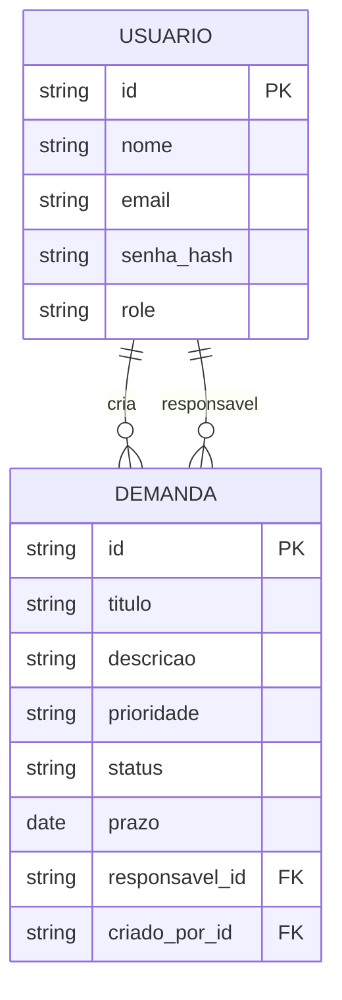

# DER — TaskFlow

## Diagrama

## Entidades

**Usuario** — gestor ou funcionario

**Demanda** — tarefa com titulo, prioridade, status e prazo

## Relacionamentos

- gestor cria demandas (1:N)
- funcionario é responsavel por demandas (1:N)

## Tabelas

**usuarios:** id, nome, email, senha_hash, role, created_at, updated_at

**demandas:** id, titulo, descricao, prioridade, status, prazo, responsavel_id, criado_por_id, created_at, updated_at

Código: `api/prisma/schema.prisma`
